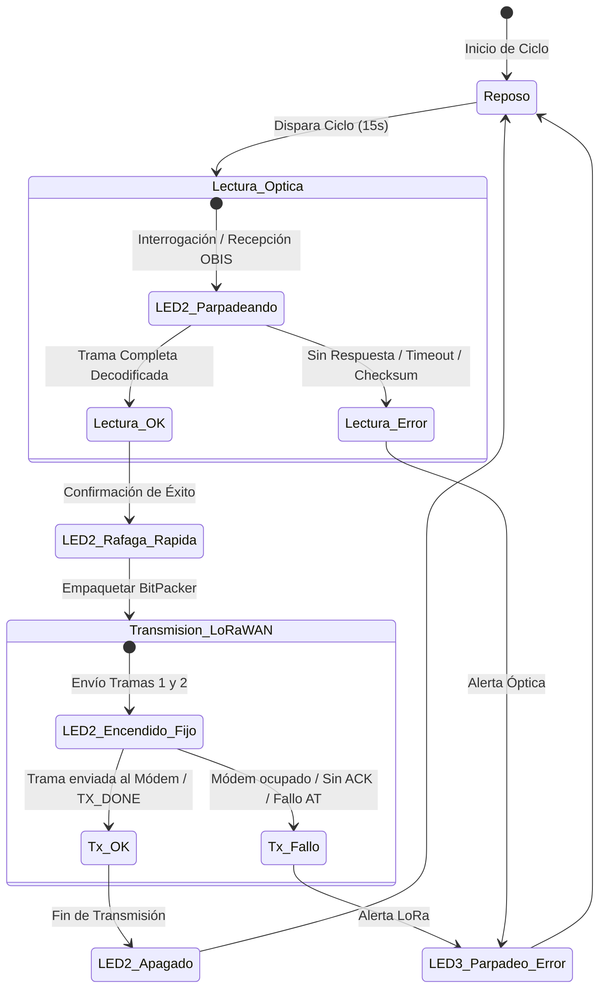
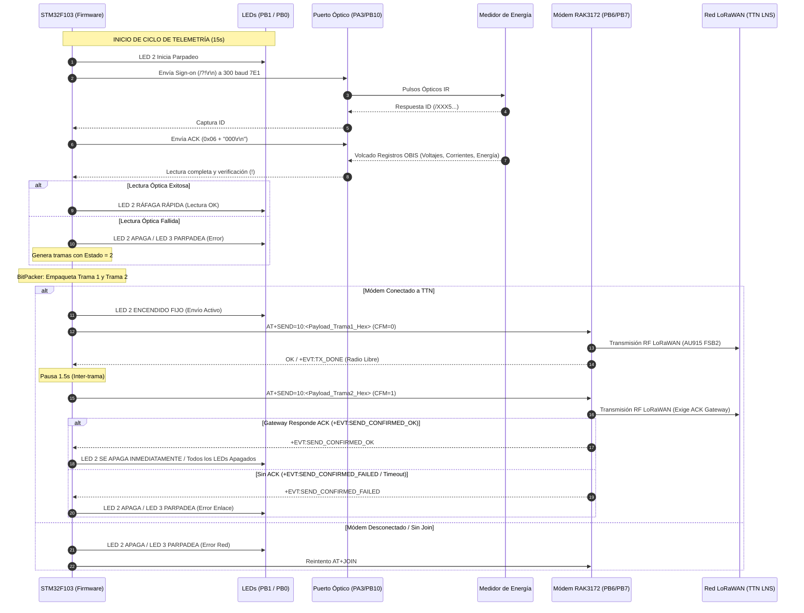

# 📜 ESPECIFICACIÓN MANDATORIA: LÓGICA COMPLETA DEL PROGRAMA
## Sistema de Telemetría y Telegestión Eléctrica `ElectroKaptor` (Placa `ME_LoRa_v3.6`)

> [!IMPORTANT]
> **DOCUMENTO NORMATIVO Y MANDATORIO DE ARQUITECTURA Y FUNCIONAMIENTO**
> Este documento define la lógica funcional, temporal y de señalización que rige de manera obligatoria el comportamiento del firmware en el microcontrolador principal **STM32F103C8T6** y el módem LoRaWAN **RAK3172**. Cualquier modificación futura debe adherirse estrictamente a esta especificación.

---

## 1. 🏗️ Arquitectura General y Mapa Físico de Hardware

El sistema está compuesto por un microcontrolador anfitrión **STM32F103C8T6** (ARM Cortex-M3 a 72 MHz) conectado directamente a un módem LoRaWAN **RAK3172** (STM32WLE5CC / SX1262), una sonda óptica infrarroja bidireccional y un conjunto de relays de corte/reconexión.

```
       +-------------------------------------------------------------+
       |               ELECTROKAPTOR (ME_LoRa_v3.6)                  |
       |                                                             |
       |  [Fuente Hi-Link 220V->5V] -----> [LED Verde D6: Aliment.]  |
       |                                                             |
       |  [STM32F103C8T6 (MCU)]                                      |
       |     • PB1  (Active-LOW) -------> [LED 2 D5: Actividad/Envío]|
       |     • PB0  (Active-LOW) -------> [LED 3 D3: Error/Fallo]    |
       |     • PB2  (Active-LOW) -------> [LED 4 D4: Reserva]        |
       |     • PC13 (Active-LOW) -------> [LED MCU: Heartbeat]       |
       |                                                             |
       |     • PA3 (RX) / PB10 (TX) ----> [Puerto Óptico IR IEC]     |
       |     • PB6 (TX) / PB7 (RX)  <---> [Módem LoRaWAN RAK3172]   |
       |     • PB8 (NRST) --------------> [Reset Módem RAK3172]      |
       |     • PA8 / PA9 ---------------> [Relays Desconexión/Conex.]|
       +-------------------------------------------------------------+
```

### Tabla Oficial de Asignación de Pines:
| Señal | Pin STM32 (LQFP48) | GPIO | Tipo / Modo | Función |
| :--- | :---: | :---: | :---: | :--- |
| **LED Actividad / Envío (LED 2)** | Pin 19 | `PB1` | Salida Active-LOW | Señalización de Lectura Óptica y Envío LoRaWAN |
| **LED Fallo / Error (LED 3)** | Pin 18 | `PB0` | Salida Active-LOW | Indicación visual de cualquier condición de error |
| **LED Reserva (LED 4)** | Pin 20 | `PB2` | Salida Active-LOW | Pin de reserva (apagado por defecto) |
| **LED Onboard Status** | Pin 2 | `PC13` | Salida Active-LOW | Heartbeat de latido del microcontrolador |
| **Puerto Óptico RX** | Pin 13 | `PA3` | Entrada Pull-Up | Recepción serie bitbang / UART desde fototransistor |
| **Puerto Óptico TX** | Pin 21 | `PB10` | Salida Push-Pull | Transmisión serie bitbang hacia LED emisor IR |
| **LoRaWAN TX (Host -> RAK)** | Pin 42 | `PB6` | `USART1_TX` (Remap) | Comandos AT a 115200 baudios |
| **LoRaWAN RX (RAK -> Host)** | Pin 43 | `PB7` | `USART1_RX` (Remap) | Respuestas AT y eventos de red |
| **LoRaWAN Reset** | Pin 45 | `PB8` | Salida Push-Pull | Control de Reset por hardware (`NRST`) del RAK3172 |
| **Relay Desconexión** | Pin 29 | `PA8` | Salida Digital | Pulso para corte remoto de suministro eléctrico |
| **Relay Conexión** | Pin 30 | `PA9` | Salida Digital | Pulso para reconexión remota de suministro eléctrico |

---

## 2. 💡 ESPECIFICACIÓN MANDATORIA DE SEÑALIZACIÓN POR LEDS

Todos los LEDs controlados por el microcontrolador operan bajo **lógica Active-LOW** (`LOW` = Encendido / `HIGH` = Apagado).



### Reglas Inviolables de Comportamiento de LEDs:

### 🟢 1. LED 2 (`PB1` - LED de Actividad y Envío de Datos):
1. **Durante la Lectura Óptica:** **Parpadea de forma intermitente** (ritmo visible ~100ms) mientras el sistema envía los comandos de handshake IEC (`/?!\r\n`, ACK) y recibe el volcado de registros OBIS.
2. **Si la Lectura Óptica es Exitosa:** **Parpadea rápidamente en ráfaga** (~40ms por pulso, 8 a 10 destellos rápidos) para indicar al operador en campo que los datos del medidor fueron capturados y decodificados con éxito.
3. **Durante el Envío de Datos por LoRaWAN:** **Permanece ENCENDIDO FIJO continuo** desde que inicia la transferencia de las tramas de telemetría (Trama 1 y Trama 2) hacia el módem RAK3172 y la red TTN, manteniéndose encendido durante todo el proceso de radio.
4. **Al Finalizar la Transmisión:** **Se APAGA** por completo, retornando al estado de reposo.

### 🔴 2. LED 3 (`PB0` - LED Indicador de Fallo / Error):
* **Ante CUALQUIER ERROR:** **Parpadea repetidamente** (destellos de advertencia) para señalar inequívocamente la presencia de un fallo.
  * **Casos de activación obligatoria de LED 3:**
    * *Error Óptico:* Sonda óptica sin respuesta, medidor no responde al Sign-on, timeout en recepción de registros OBIS o trama corrupta (4 destellos a 100ms).
    * *Error de Módem LoRaWAN:* El módem RAK3172 no responde a los comandos AT durante la inicialización o verificación de salud (5 destellos a 100ms).
    * *Error de Transmisión LoRaWAN:* Fallo al emitir el comando `AT+SEND` o buffer ocupado (4 destellos a 80ms).
    * *Fallo de Join / Reconexión:* Si el módem pierde enlace con el Gateway (ej. Gateway apagado) y falla la solicitud de Join OTAA durante el ciclo de reconexión, emite una secuencia rápida distintiva de **5 destellos de error (80ms)** en el LED 3.
    * *Excepciones Críticas:* Entrada a rutinas de excepción de hardware (`HardFault`, `BusFault`, `UsageFault`).

### ⚪ 3. LED 4 (`PB2` - Reserva):
* Permanece apagado de forma permanente en operación normal.

### 🔵 4. LED MCU (`PC13` - Heartbeat):
* Emite un destello ultracorto (50ms) en cada vuelta del bucle `loop()` principal para constatar que el reloj del Cortex-M3 está activo y no bloqueado.

### 🟡 5. LED 1 (D6 Verde - Alimentación 220V AC):
* Controlado por hardware directo desde la salida de la fuente Hi-Link. Indica presencia de tensión eléctrica de red de entrada.

---

## 3. ⏱️ SECUENCIA TEMPORAL DEL CICLO DE VIDA DEL PROGRAMA

### A. Fase de Arranque (`setup()`):
1. **Configuración de Reloj del Sistema:** Inicialización del oscilador HSE externo de 16 MHz con PLL a 72 MHz (con fallback automático al oscilador interno HSI a 48 MHz si falla el cristal externo).
2. **Inicialización de GPIOs y LEDs:** Configuración de `PB1`, `PB0`, `PB2`, `PC13` como salidas y apagado inicial seguro.
3. **Inicialización de Puerto de Depuración:** UART de diagnóstico a 115200 baudios.
4. **Arranque y Configuración del Módem RAK3172:**
   - Habilitación del remapeo de periférico `USART1` a pines `PB6` (TX) y `PB7` (RX).
   - Pulso de Reset por hardware en pin `PB8` (`NRST`).
   - Sincronización mediante comando `AT` a 115200 baudios.
   - Configuración de parámetros de red: `AT+NWM=1` (LoRaWAN), `AT+NJM=1` (OTAA), `AT+BAND=6` (AU915), `AT+MASK=0002` (FSB2 Canales 8-15), `AT+CFM=0` (Unconfirmed), `AT+ADR=1`.
   - Carga de credenciales seguras: `AT+DEVEUI`, `AT+APPEUI`, `AT+APPKEY`.
   - Lanzamiento de solicitud de Auto-Join en segundo plano: `AT+JOIN=1:1:10:8`.

---

### B. Ciclo Periódico de Telemetría (`loop()` - Cada 15 Segundos):



---

## 4. 🔬 ESPECIFICACIÓN DEL PROTOCOLO ÓPTICO (IEC 62056-21 MODO C)

* **Parámetros Físicos Serie:** 300 baudios, 7 bits de datos, Paridad Par (Even), 1 o 2 bits de parada (**7E1**), implementado mediante bitbang de precisión con temporización de $3333.33\,\mu\text{s}$ por bit.
* **Secuencia de Transacción:**
  1. *Sign-on:* `/?!\r\n`.
  2. *Identificación:* El medidor responde con su cadena `/XXX5...` (ej. `/MDE5DTS27...`).
  3. *Comando de volcado (ACK):* Enviar byte `0x06` seguido del comando de velocidad y modo `"000\r\n"`.
  4. *Recepción del Bloque de Datos OBIS:* Parseo dinámico de líneas hasta encontrar el delimitador de fin de trama `!`.

### Mapeo de Códigos OBIS Decodificados:
| Código OBIS Estándar | Código OBIS Reducido | Magnitud Eléctrica | Unidad | Conversión / Escala |
| :--- | :--- | :--- | :---: | :--- |
| `1.0.32.7.0` | `32.7.0` | Voltaje Fase A | Voltios (V) | Entero directo ($1\,\text{V}$) |
| `1.0.52.7.0` | `52.7.0` | Voltaje Fase B | Voltios (V) | Entero directo ($1\,\text{V}$) |
| `1.0.72.7.0` | `72.7.0` | Voltaje Fase C | Voltios (V) | Entero directo ($1\,\text{V}$) |
| `1.0.31.7.0` | `31.7.0` | Corriente Fase A | Amperios (A) | Multiplicado $\times 100$ ($0.01\,\text{A}$) |
| `1.0.51.7.0` | `51.7.0` | Corriente Fase B | Amperios (A) | Multiplicado $\times 100$ ($0.01\,\text{A}$) |
| `1.0.71.7.0` | `71.7.0` | Corriente Fase C | Amperios (A) | Multiplicado $\times 100$ ($0.01\,\text{A}$) |
| `1.0.13.7.0` | `13.7.0` | Factor de Potencia ($\cos \phi$) | Adimensional | Multiplicado $\times 100$ ($0.01$) |
| `1.0.14.7.0` | `14.7.0` | Frecuencia de Red | Hertz (Hz) | Multiplicado $\times 100$ ($0.01\,\text{Hz}$) |
| `1.0.1.8.0` / `1.0.15.8.0` | `1.8.0` / `15.8.0` | Energía Activa Importada | kWh | Multiplicado $\times 100$ ($0.01\,\text{kWh}$) |
| `1.0.2.8.0` | `2.8.0` | Energía Activa Exportada | kWh | Multiplicado $\times 100$ ($0.01\,\text{kWh}$) |
| `1.0.3.8.0` | `3.8.0` | Energía Reactiva Importada | kvarh | Multiplicado $\times 100$ ($0.01\,\text{kvarh}$) |
| `1.0.4.8.0` | `4.8.0` | Energía Reactiva Exportada | kvarh | Multiplicado $\times 100$ ($0.01\,\text{kvarh}$) |
| `1.0.1.6.0` | `1.6.0` | Demanda Máxima Activa | kW | Multiplicado $\times 100$ ($0.01\,\text{kW}$) |

---

## 5. 📦 EMPAQUETADO BINARIO DE TELEMETRÍA (BITPACKER)

Para maximizar la eficiencia del enlace LoRaWAN en la sub-banda AU915 FSB2 y evitar saturación de duty-cycle, los datos se empaquetan en dos tramas compactas a nivel de bit:

### Trama 1 (Mensaje 0 - Telemetría Principal / Puerto 10):
* **Cabecera (1 Byte):**
  * Bits [7..4]: Tipo de Medidor (`2` = Trifásico DTS27, `1` = Monofásico, `3` = Elster).
  * Bits [3..2]: Estado (`0` = Normal/OK, `1` = Alerta, `2` = Sin Lectura Óptica, `3` = Batería Baja).
  * Bits [1..0]: Tipo de Mensaje (`0` = Trama Principal).
* **Campos Eléctricos:**
  * Voltajes A, B, C: 10 bits cada uno ($0 - 1023\,\text{V}$).
  * Corrientes A, B: 14 bits cada una ($0 - 163.83\,\text{A}$).
  * Factor de Potencia ($\cos \phi$): 7 bits ($0.00 - 1.00$).
  * Frecuencia Mínima: 7 bits (offset de $45.00\,\text{Hz}$).
  * Energía Activa Importada: 24 bits ($0 - 167772.15\,\text{kWh}$).

### Trama 2 (Mensaje 1 - Demandas y Energía Secundaria / Puerto 10):
* **Cabecera (1 Byte):**
  * Bits [7..4]: Tipo de Medidor.
  * Bits [3..2]: Estado.
  * Bits [1..0]: Tipo de Mensaje (`1` = Trama Secundaria).
* **Campos Eléctricos:**
  * Energía Activa Exportada: 24 bits.
  * Energías Reactivas Importada / Exportada: 24 bits cada una.
  * Demanda Máxima Activa: 16 bits ($0 - 655.35\,\text{kW}$).

---

## 6. 📡 GESTIÓN DEL ENLACE LORAWAN Y MÓDEM RAK3172

* **Puerto LoRaWAN:** Puerto de Aplicación `10`.
* **Data Rate:** DR3 (SF7 / 125 kHz) para compatibilidad con payloads de hasta 242 bytes y evitar el límite de 11 bytes de Dwell Time en AU915.
* **Estrategia Híbrida de Confirmación (Ciclo-ACK):**
  * **Trama 1 (Mensaje 0):** Modo No Confirmado (`AT+CFM=0`), emisión ultrarrápida sin requerir downlink del Gateway.
  * **Trama 2 (Mensaje 1):** Modo Confirmado (`AT+CFM=1`), exigiendo acuse de recibo (**ACK**) del Gateway para validar 100% el enlace de radio del ciclo de telemetría sin sobrecargar el duty cycle del Gateway.
* **Sincronización por Evento de Radio (`+EVT:TX_DONE`):**
  * El manejador espera activamente el evento de finalización real del transceptor de radio antes de liberar la ejecución, eliminando totalmente los errores por colisión de comandos (`AT_BUSY_ERROR`).
* **Control de Fallos Consecutivos y Auto-Reconexión:**
  * El manejador contabiliza las transmisiones consecutivas fallidas (`_failCount`).
  * Si ocurren $\ge 2$ fallos sucesivos (ej. Gateway apagado o fuera de rango), el sistema invalida el flag `_joined = false`, apaga el LED 2, hace parpadear el **LED 3 de error** (4 destellos a 100ms) y dispara automáticamente una re-sincronización `AT+JOIN=1:1:10:8` en segundo plano.

---

## 7. 🛡️ MECANISMOS DE RESILIENCIA Y SEGURIDAD DEL SISTEMA

1. **Gestión de Memoria y Stack:**
   * Prohibición absoluta de asignación dinámica de memoria en tiempo de ejecución (`malloc`, `free`, `new` en bucle).
   * Uso exclusivo de buffers globales estáticos en RAM para aislar el Stack de 20 KB de la MCU STM32.
2. **Trampa Visual de Excepciones Cortex-M3:**
   * En caso de dispararse un `HardFault_Handler`, `BusFault_Handler` o `UsageFault_Handler`, el microcontrolador entra en un bucle infinito que hace parpadear el **LED 3 (PB0)** a 1 Hz para facilitar el diagnóstico físico en banco de pruebas.
3. **Estructura `OpticalDiag` para Depuración SWD:**
   * Estructura alineada en RAM estática con cabecera mágica `0x0771C41D` para lectura no intrusiva por ST-Link/OpenOCD.
4. **Cumplimiento Directiva de Seguridad (`AGENTS.md`):**
   * Ningún archivo del repositorio ni commit contendrá DevEUIs, AppKeys o credenciales reales de producción.

---

## 8. 📜 MATRIZ DE CONFORMIDAD NORMATIVA

Cualquier cambio de código en este repositorio debe validar la siguiente matriz:

| Requisito | Estado | Función Responsable |
| :--- | :---: | :--- |
| **LED 2 parpadea en lectura óptica** | MANDATORIO | `MiddeDTS27Reader::readMeter()`, `ElsterA150Reader::readMeter()` |
| **LED 2 parpadea rápido en lectura exitosa** | MANDATORIO | `MiddeDTS27Reader::readMeter()` |
| **LED 2 encendido continuo durante envío LoRaWAN** | MANDATORIO | `main.cpp (loop())` |
| **LED 2 se apaga al finalizar envío** | MANDATORIO | `main.cpp (loop())` |
| **LED 3 parpadea ante cualquier fallo/error** | MANDATORIO | `main.cpp`, `MiddeDTS27Reader.cpp`, `LoRaWAN_Handler.cpp` |
| **Sin claves ni EUIs reales en Git** | MANDATORIO | Verificación pre-commit según `AGENTS.md` |
