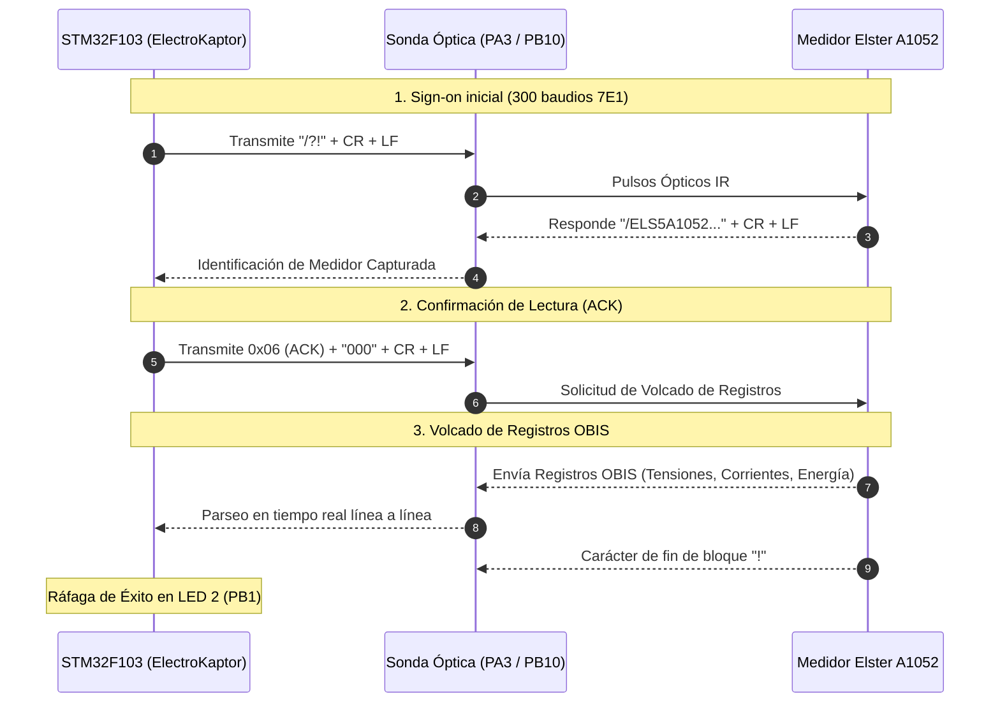

# 📘 Driver de Medidor Trifásico: Elster A1052

Este documento detalla la integración, protocolo óptico infrarrojo, mapeo de registros OBIS y formato de telemetría del medidor trifásico **Elster A1052** en la plataforma **ElectroKaptor** (`ME_LoRa_v3.6`).

---

## 1. 🔌 Capa Física y Conexión Óptica

El puerto óptico frontal del medidor Elster A1052 opera bajo el estándar **IEC 62056-21 (anteriormente IEC 1107)**.

| Parámetro | Valor / Configuración |
| :--- | :--- |
| **Pin MCU RX** | `PA3` (Entrada con Pull-Up interno) |
| **Pin MCU TX** | `PB10` (Salida Push-Pull / Infrarrojo) |
| **Velocidad de Señalización Inicial** | 300 Baudios |
| **Formato de Carácter** | 7 bits de datos, Paridad Par (**7E1**), 1 o 2 bits de stop |
| **Lógica Infrarroja** | Reposo (IDLE) en `HIGH` |
| **Modo de Operación** | Modo C (Handshake Bidireccional Sign-on + Lectura OBIS) |

---

## 2. 📡 Secuencia de Protocolo IEC 62056-21 Modo C

---

## 3. 📊 Mapeo de Códigos OBIS Soportados

| Registro OBIS | Descripción | Campo en `MeterData` | Unidad / Factor |
| :--- | :--- | :--- | :--- |
| `1.8.0(...)` | Consumo Acumulado de Energía Activa Importada | `energiaActivaImp` | kWh (x100) |
| `2.8.0(...)` | Consumo Acumulado de Energía Activa Exportada | `energiaActivaExp` | kWh (x100) |
| `3.8.0(...)` | Consumo Acumulado de Energía Reactiva Importada | `energiaReactivaImp` | kVARh (x100) |
| `4.8.0(...)` | Consumo Acumulado de Energía Reactiva Exportada | `energiaReactivaExp` | kVARh (x100) |
| `1.6.0(...)` | Máxima Demanda de Importación en el Periodo | `maximaDemandaImp` | kW (x100) |
| `32.5.0(...)` / `32.7.0(...)` | Tensión Fase A | `voltajeA` | Volts (V) |
| `52.5.0(...)` / `52.7.0(...)` | Tensión Fase B | `voltajeB` | Volts (V) |
| `72.5.0(...)` / `72.7.0(...)` | Tensión Fase C | `voltajeC` | Volts (V) |
| `31.5.0(...)` / `31.7.0(...)` | Corriente Fase A | `corrienteA` | Amperes (x100) |
| `51.5.0(...)` / `51.7.0(...)` | Corriente Fase B | `corrienteB` | Amperes (x100) |
| `71.5.0(...)` / `71.7.0(...)` | Corriente Fase C | `corrienteC` | Amperes (x100) |
| `13.5.0(...)` / `33.7.0(...)` | Factor de Potencia Instantáneo ($\cos \phi$) | `cosphi` | Valor (x100) |
| `14.5.0(...)` / `14.7.0(...)` | Frecuencia de Red | `frecuenciaMin` | Hz (x100) |
| `0.0.0(...)` | Número de Serie del Medidor | Diagnóstico interno | Texto ASCII |
| `96.1.1(...)` | Identificador de Producto (Elster A1052) | Diagnóstico interno | Texto ASCII |

---

## 4. 💡 Señalización Visual por LEDs (Directiva Mandatoria)

El driver utiliza la clase base unificada `BaseMeterReader` (`IMeterReader.h`) respetando el estándar:

1. **LED 2 (`PB1` - Verde/Actividad):**
   - **Durante Lectura Óptica:** Parpadeo intermitente (~100ms) durante la interrogación y recepción OBIS.
   - **Lectura Exitosa:** Ráfaga rápida de 8 destellos a 40ms.
   - **Transmisión LoRaWAN:** Encendido fijo durante el envío de Tramas 1 y 2, apagándose inmediatamente al finalizar.
2. **LED 3 (`PB0` - Rojo/Error):**
   - **Fallo Óptico / Timeout:** 4 destellos a 100ms si el medidor no responde o la trama es inválida.
3. **LED MCU (`PC13`):**
   - Heartbeat de 50ms en cada ciclo `loop()`.

---

## 5. 📦 Formato de Tramas LoRaWAN (Tipo Medidor = 2)

Las tramas se transmiten en formato empaquetado binario / ASCII Hex:
- **Trama 1 (Mensaje 0 - Telemetría Principal):** Incluye Tipo de Medidor (`2` = Trifásico), Estado (`0` = Normal), Batería, $\cos \phi$, Tensiones ($V_A, V_B, V_C$), Corrientes ($I_A, I_B, I_C$) y Energía Activa Importada ($kWh$).
- **Trama 2 (Mensaje 1 - Demandas y Energía Secundaria):** Incluye Energía Activa Exportada, Energías Reactivas (Importada y Exportada), Máxima Demanda Importada y Exportada.
