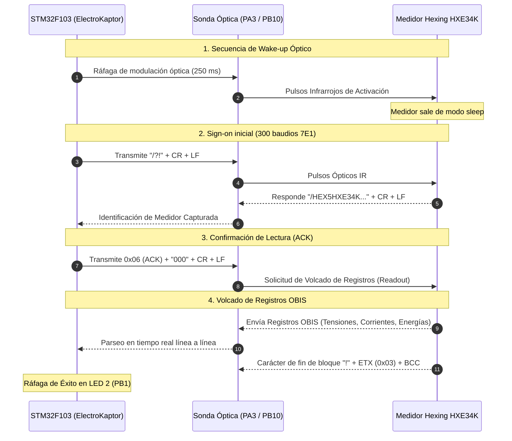

# 📘 Driver de Medidor Trifásico: Hexing HXE34K

Este documento detalla la integración técnica, protocolo óptico infrarrojo, secuencia de wake-up, mapeo de registros OBIS y formato de telemetría del medidor trifásico **Hexing Modelo HXE34K** en la plataforma **ElectroKaptor** (`ME_LoRa_v3.6` sobre STM32F103C8T6).

---

## 1. 🔌 Capa Física y Conexión Óptica

El puerto óptico frontal del medidor Hexing HXE34K opera bajo el estándar **IEC 62056-21 (anteriormente IEC 1107)**.

| Parámetro | Valor / Configuración |
| :--- | :--- |
| **Pin MCU RX** | `PA3` (Entrada con Pull-Up interno / Fototransistor IR) |
| **Pin MCU TX** | `PB10` (Salida Push-Pull / LED Transmisor Infrarrojo) |
| **Velocidad de Señalización Inicial** | 300 Baudios (1 bit = 3333 µs) |
| **Formato de Carácter** | 7 bits de datos, Paridad Par (**7E1**), 1 o 2 bits de stop |
| **Lógica Infrarroja** | Reposo (IDLE) en `HIGH` |
| **Modo de Operación** | IEC 62056-21 Modo C (Wake-up + Sign-on + Lectura OBIS) |

---

## 2. 📡 Secuencia de Protocolo IEC 62056-21 Modo C con Wake-up

Los medidores Hexing frecuentemente entran en reposo óptico de bajo consumo cuando no hay actividad. Por ello, el driver implementa una secuencia previa de wake-up óptico antes del comando de sign-on:

---

## 3. 📊 Mapeo de Códigos OBIS Soportados (Hexing HXE34K)

| Registro OBIS | Descripción | Campo en `MeterData` | Unidad / Factor |
| :--- | :--- | :--- | :--- |
| `1.8.0(...)` | Consumo Acumulado de Energía Activa Importada Total | `energiaActivaImp` | kWh (x100) |
| `2.8.0(...)` | Consumo Acumulado de Energía Activa Exportada Total | `energiaActivaExp` | kWh (x100) |
| `3.8.0(...)` | Consumo Acumulado de Energía Reactiva Importada Total | `energiaReactivaImp` | kVARh (x100) |
| `4.8.0(...)` | Consumo Acumulado de Energía Reactiva Exportada Total | `energiaReactivaExp` | kVARh (x100) |
| `1.6.0(...)` / `1.2.0(...)` | Máxima Demanda de Importación en el Periodo | `maximaDemandaImp` | kW (x100) |
| `32.7.0(...)` / `32.5.0(...)` | Tensión Instantánea Fase A | `voltajeA` | Volts (V) |
| `52.7.0(...)` / `52.5.0(...)` | Tensión Instantánea Fase B | `voltajeB` | Volts (V) |
| `72.7.0(...)` / `72.5.0(...)` | Tensión Instantánea Fase C | `voltajeC` | Volts (V) |
| `31.7.0(...)` / `31.5.0(...)` | Corriente Instantánea Fase A | `corrienteA` | Amperes (x100) |
| `51.7.0(...)` / `51.5.0(...)` | Corriente Instantánea Fase B | `corrienteB` | Amperes (x100) |
| `71.7.0(...)` / `71.5.0(...)` | Corriente Instantánea Fase C | `corrienteC` | Amperes (x100) |
| `13.7.0(...)` / `13.5.0(...)` | Factor de Potencia Instantáneo ($\cos \phi$) | `cosphi` | Valor (x100) |
| `14.7.0(...)` / `14.5.0(...)` | Frecuencia de Red | `frecuenciaMin` | Hz (x100) |
| `0.0.0(...)` | Número de Serie del Medidor | Diagnóstico interno | Texto ASCII |
| `96.1.1(...)` | Identificador de Producto / Modelo | Diagnóstico interno | Texto ASCII |

---

## 4. 🔒 Política Estricta de Cero Hardcoding

En concordancia con la directiva mandatoria de seguridad y precisión física del proyecto:
1. Todos los campos de medición de `MeterData` se inicializan en estricto cero (`0`).
2. No se asignan valores nominales ni estimados (ej. 220V / 230V).
3. Si una fase o registro no está conectado o no es reportado en la trama óptica, el valor enviado al servidor LoRaWAN permanece estrictamente en `0`.

---

## 5. 💡 Señalización Visual por LEDs (Active-LOW)

1. **LED 2 (`PB1` - Actividad):**
   - **Durante Lectura Óptica:** Parpadeo (~100 ms) durante el wake-up, sign-on y recepción OBIS.
   - **Lectura Exitosa:** Ráfaga rápida de 8 destellos a 40 ms.
   - **Transmisión LoRaWAN:** Encendido fijo durante el envío de las Tramas 1 y 2, apagándose inmediatamente al finalizar.
2. **LED 3 (`PB0` - Fallo / Alerta):**
   - Parpadea 4 veces a 100 ms ante timeout o ausencia de respuesta óptica del medidor.
3. **LED MCU (`PC13`):**
   - Heartbeat regular de 50 ms.
