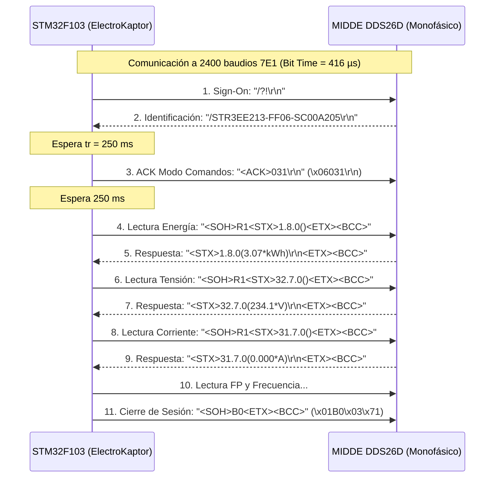

# 📖 Especificación Técnica: Medidor MIDDE DDS26D (Monofásico)

## 📌 Descripción General
* **Fabricante / Origen:** Shenzhen Star Instrument Co., Ltd. (Comercializado como MIDDE / MYEEL).
* **Modelo:** DDS26D Monofásico Residencial / Comercial.
* **Identificación Óptica:** `/STR3EE213-FF06-SC00A205\r\n`
* **Tipo en Firmware:** `tipoMedidor = 1` (Monofásico).
* **Driver C++:** `MiddeDDS26DReader.h` / `MiddeDDS26DReader.cpp`

---

## ⚙️ Parámetros de Comunicación Óptica

| Parámetro | Valor Verificado en Laboratorio |
| :--- | :--- |
| **Interfaz Física** | Puerto Óptico Frontal IEC 62056-21 (Fotodiodo emisor / receptor infrarrojo) |
| **Pines MCU (STM32F103)** | `PA3` (RX Sonda Óptica con Pull-Up) / `PB10` (TX Sonda Óptica) |
| **Velocidad de Baudios** | **2400 baudios** (`BIT_TIME_US = 416 µs`) |
| **Estructura de Trama** | **7 bits de datos, Paridad Par (Even), 1 bit de parada (7E1)** |
| **Protocolo de Capa de Aplicación** | **IEC 62056-21 Modo 1 (Command / Programming Mode)** |
| **Temporización de Conmutación ($t_r$)** | **250 ms** entre recepción de ID y envío de ACK |

---

## 🔄 Secuencia de Comunicación Paso a Paso

---

## 📊 Tabla de Registros OBIS Consultados

| Parámetro | Comando Enviado | Respuesta Típica Medidor | Mapeo `MeterData` | Unidad |
| :--- | :--- | :--- | :--- | :--- |
| **Energía Activa Importada ($E_A$)** | `<SOH>R1<STX>1.8.0()<ETX><BCC>` | `1.8.0(3.07*kWh)` | `energiaActivaImp = 307` | kWh ($\times 100$) |
| **Tensión de Fase A ($V_A$)** | `<SOH>R1<STX>32.7.0()<ETX><BCC>` | `32.7.0(234.1*V)` | `voltajeA = 234` | Volts |
| **Corriente de Fase A ($I_A$)** | `<SOH>R1<STX>31.7.0()<ETX><BCC>` | `31.7.0(0.000*A)` | `corrienteA = 0` | Amperes ($\times 100$) |
| **Factor de Potencia ($\cos\varphi$)** | `<SOH>R1<STX>33.7.0()<ETX><BCC>` | `33.7.0(1.000)` | `cosphi = 100` | $\cos\varphi$ ($\times 100$) |
| **Frecuencia de Red ($f$)** | `<SOH>R1<STX>14.7.0()<ETX><BCC>` | `14.7.0(50.04*Hz)` | `frecuenciaMin = 5004` | Hz ($\times 100$) |

---

## 📡 Integración LoRaWAN (TTN)

Los datos obtenidos se empaquetan en el formato binario de 15 bytes:
* **Trama 1 (Mensaje 0):** `100641D40000000000000000000266`
  * Byte 0: `0x10` (Estado=0 Normal, Tipo=1 Monofásico, Batería=0)
  * Byte 1: `0x64` ($\cos\varphi = 1.00$)
  * Bytes 2-3: `0x00EA` ($V_A = 234\text{ V}$)
  * Bytes 4-5: `0x0000` ($I_A = 0.00\text{ A}$)
  * Bytes 6-9: `0x00000133` ($E_A = 3.07\text{ kWh}$)
  * Bytes 10-11: `0x0000` ($E_R = 0.00\text{ kVARh}$)
  * Bytes 12-13: `0x138C` ($f = 50.04\text{ Hz}$)
  * Byte 14: `0x00` ($T = 0^\circ\text{C}$)
