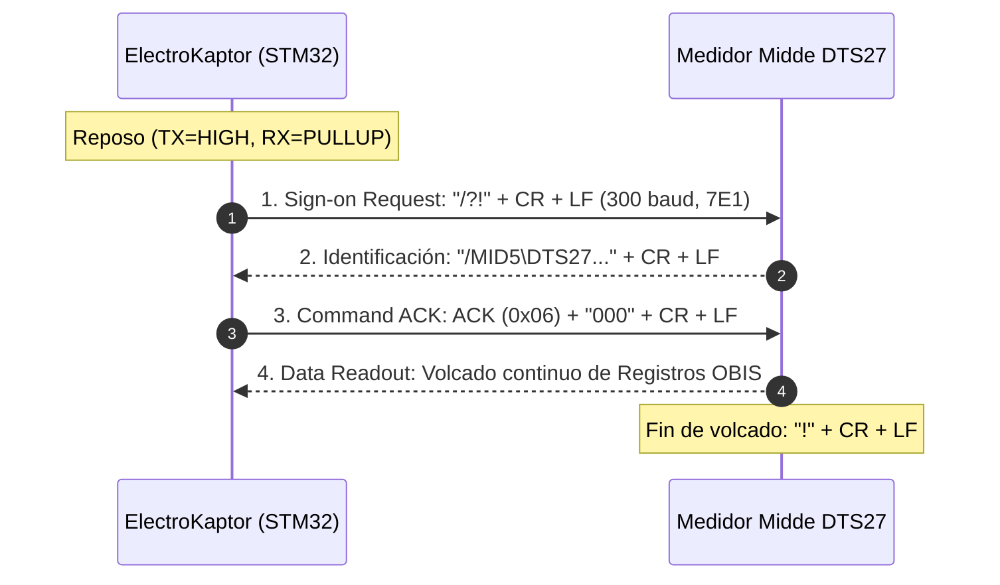

# ⚡ Especificación Técnica de Integración: Medidor Trifásico Midde DTS27
## Driver de Lectura Óptica IEC 62056-21 Modo C y Registros OBIS

---

## 1. 📖 Descripción General del Medidor
El **Midde DTS27** es un medidor electrónico de energía eléctrica trifásico multifunción para clientes residenciales, comerciales e industriales.
- **Tipo de Conexión:** Trifásico 4 hilos ($V_A, V_B, V_C$ / $I_A, I_B, I_C$ / Neutro).
- **Protocolo de Comunicación:** **IEC 62056-21 Modo C** (Handshake interactivo bidireccional por puerto óptico infrarrojo).
- **Estructura de Datos:** Bloque de volcado de registros en formato de códigos **OBIS** (ASCII estándar).

---

## 2. 📡 Especificación de la Capa Física y Protocolo IEC 62056-21

- **Velocidad Inicial (Handshake):** **300 baudios**
- **Formato de Carácter:** **7E1** (7 bits de datos, paridad par *Even*, 1 bit de parada / 2 bits de parada en TX).
- **Tiempo de Bit nominal ($T_{bit}$):**
  $$\text{Bit Time} = \frac{1\,000\,000\,\mu\text{s}}{300} = 3333.33\,\mu\text{s}$$
- **Pines Físicos:**
  - **RX (`PA3`):** Entrada con Pull-Up conectada al fototransistor de la sonda.
  - **TX (`PB10`):** Salida Digital hacia el LED emisor de la sonda (Reposo en `HIGH`).

---

## 3. 🤝 Secuencia de Handshake IEC 62056-21 Modo C



1. **Sign-on:** El host emite la cadena `/?!\r\n` a 300 baudios 7E1.
2. **Respuesta de Identificación:** El medidor responde con su encabezado de fabricante y modelo (ej: `/MID5\DTS27...`).
3. **Solicitud de Volcado:** El host confirma con el caracter ASCII `ACK` (`0x06`) seguido de `000\r\n` (modo lectura de datos a 300 baudios estándar).
4. **Volcado de Registros OBIS:** El medidor transmite línea por línea todos los registros energéticos finalizando con el caracter `!`.

---

## 4. 🗺️ Tabla de Códigos OBIS y Mapeo a Telemetría

El parser de [`MiddeDTS27Reader.cpp`](file:///c:/Users/nahuel/Documents/Antigravity/ElectroKaptor/firmware/src/MiddeDTS27Reader.cpp) procesa las líneas entrantes extrayendo los valores numéricos entre paréntesis:

| Código OBIS | Nombre del Parámetro | Unidad Medidor | Conversión a `MeterData` |
| :--- | :--- | :---: | :---: |
| `1.0.32.7.0` / `32.7.0` | **Voltaje Fase A ($V_A$)** | $\text{V}$ | Entero en Volts ($220\text{ V}$) |
| `1.0.52.7.0` / `52.7.0` | **Voltaje Fase B ($V_B$)** | $\text{V}$ | Entero en Volts ($220\text{ V}$) |
| `1.0.72.7.0` / `72.7.0` | **Voltaje Fase C ($V_C$)** | $\text{V}$ | Entero en Volts ($220\text{ V}$) |
| `1.0.31.7.0` / `31.7.0` | **Corriente Fase A ($I_A$)** | $\text{A}$ | Centésimas de Ampere ($A \times 100$) |
| `1.0.51.7.0` / `51.7.0` | **Corriente Fase B ($I_B$)** | $\text{A}$ | Centésimas de Ampere ($A \times 100$) |
| `1.0.71.7.0` / `71.7.0` | **Corriente Fase C ($I_C$)** | $\text{A}$ | Centésimas de Ampere ($A \times 100$) |
| `1.0.13.7.0` / `13.7.0` | **Factor de Potencia ($\cos\varphi$)** | Adimensional | Centésimas ($FP \times 100$) |
| `1.0.14.7.0` / `14.7.0` | **Frecuencia de Red** | $\text{Hz}$ | Centésimas de Hz ($Hz \times 100$) |
| `1.0.1.8.0` / `1.8.0` | **Energía Activa Importada ($E_{activa}$)** | $\text{kWh}$ | Centésimas de kWh ($kWh \times 100$) |
| `1.0.2.8.0` / `2.8.0` | **Energía Activa Exportada** | $\text{kWh}$ | Centésimas de kWh ($kWh \times 100$) |
| `1.0.3.8.0` / `3.8.0` | **Energía Reactiva Importada** | $\text{kVARh}$ | Centésimas de kVARh ($kVARh \times 100$) |
| `1.0.4.8.0` / `4.8.0` | **Energía Reactiva Exportada** | $\text{kVARh}$ | Centésimas de kVARh ($kVARh \times 100$) |
| `1.0.1.6.0` / `1.6.0` | **Demanda Máxima Activa Importada** | $\text{kW}$ | Centésimas de kW ($kW \times 100$) |

---

## 5. 🏗️ Integración en Firmware

El driver está implementado en la clase [`MiddeDTS27Reader`](file:///c:/Users/nahuel/Documents/Antigravity/ElectroKaptor/firmware/src/MiddeDTS27Reader.h):

```cpp
#include "IMeterReader.h"

class MiddeDTS27Reader : public IMeterReader {
public:
  MiddeDTS27Reader(uint8_t rxPin, uint8_t txPin);
  void begin(unsigned long baudRate = 300) override;
  bool readMeter(MeterData &data, unsigned long timeoutMs = 12000) override;
  const char* getMeterName() const override { return "MIDDE DTS27 (Trifasico)"; }
};
```

### Activación en Configuración
En `firmware/src/MeterConfig.h`:
```c
#define SELECTED_METER_MODEL METER_MODEL_MIDDE_DTS27
```
Al seleccionar este modelo, `tipoMedidor = 2` (Trifásico) en las tramas empaquetadas por `BitPacker`.
